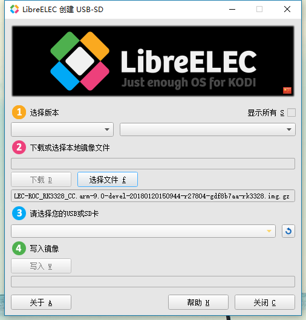

# LibreELEC 娱乐影音中心

## 前言

本文简单介绍了 LibreELEC 的使用流程。

## 制作 LibreELEC 启动盘

准备工作：

- ROC-RK3328-CC 开发板
- 下载 [LibreELEC 镜像](https://pan.baidu.com/s/1c3cfk9i)
- 下载并安装 [LibreELEC 启动盘制作工具](https://wiki.libreelec.tv/libreelec_usb-sd_creator)

操作步骤：

1. 运行 [LibreELEC 介质启动制作工具](https://wiki.libreelec.tv/libreelec_usb-sd_creator)：

    

2. 点击“选择文件”按钮，选择所下载的映像文件并确认。
3. 插入 SD 卡。
4. 在标号 3 处选择对应的 SD 卡设备。
5. 点击“写入”按钮，等待写入完成。

LibreELEC 第一次启动，会有两次重启，请耐心等待。

## 编译 LibreELEC 系统

### 准备工作

以下操作的环境是 Ubuntu 16.04 。

首先安装所需的软件包：

    sudo apt install gcc make git unzip wget xz-utils

然后设置 bash 为系统默认的 shell：

    sudo dpkg-reconfigure dash
    # 选择 No

系统原来默认的 dash 会产生脚本的兼容性问题。

详细环境搭建，可参照官网 [compile](https://wiki.libreelec.tv/compile)。

### 源码获取和编译

从 github 上获取适配过 ROC-RK3328-CC 的 LibreELEC 源码：

    git clone https://github.com/T-Firefly/LibreELEC.tv.git

编译：

    cd LibreELEC.tv/
    PROJECT=Rockchip DEVICE=RK3328 ARCH=arm UBOOT_SYSTEM=roc-cc make image

第一次构建需要等待较长的时间。编译完成后，在当前 target 目录下，将生成对应文件：

- `.img.gz` 可写入介质创建一个新的安装文件
- `.tar` 用于更新现有的安装文件

## 使用提示

- SSH 登录，用户为 "root“，密码为”libreelec“。
- LibreELEC 升级系统的方式有多种，参考 [update_libreelec](https://wiki.libreelec.tv/how_to/update_libreelec) 。
- 外部可通过 SSH/Samba 访问到 ROC-RK3328-CC 开发板，参考 [accessing_libreelec](https://wiki.libreelec.tv/accessing_libreelec) 。
- 如果切换中文？先设置皮肤字体(Skin --> Fonts --> 选择 'Arial based')，再设置语言（Regional --> Language --> 选择 'Chinese(Simple)'）。
